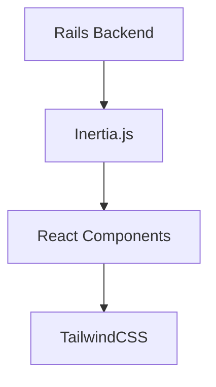
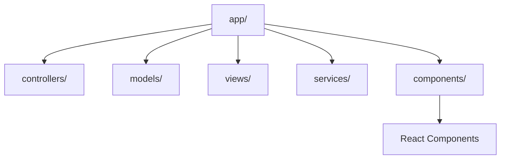

# System Patterns

## Architecture Overview

## Design Patterns
1. SOLID Principles Implementation
   - Single Responsibility Principle
   - Open/Closed Principle
   - Liskov Substitution Principle
   - Interface Segregation Principle
   - Dependency Inversion Principle

2. Rails Patterns
   - MVC Architecture
   - Service Objects
   - Form Objects
   - Query Objects
   - Presenters
   - Decorators

3. React Patterns
   - Component-Based Architecture
   - Props and State Management
   - Hooks Usage
   - Component Composition

## Component Relationships
- Rails controllers handle data and business logic
- Inertia.js manages server-client communication
- React components handle UI rendering
- TailwindCSS provides styling utilities

## Code Organization
